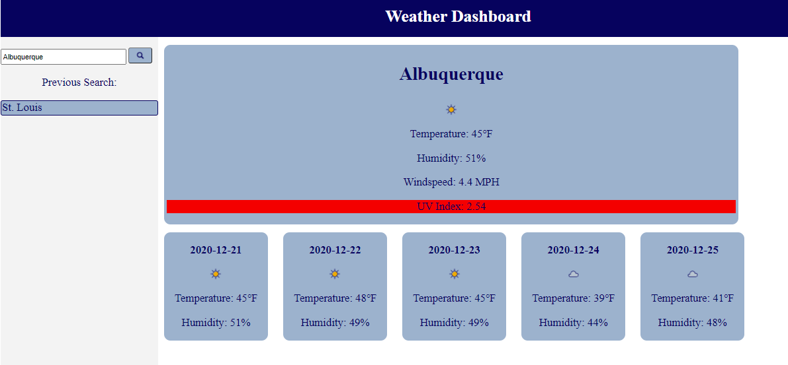

# homework6
Homework 6 - Weather Dashboard

Created an application for searching for weather by city. Search term takes city and queries two separate APIs at OpenWeatherWeatherMap.org. 

The first is a 5 day forecast. The application takes the content of this first query and renders cards to the screen.

The second API is specifically for UV index. The application takes this query and renders it into the UV index text box. The application also color codes the background of the text in accordance with the EPA's color guide.

Application also stores and displays the user's previous search. On click, the application will render the previous search again.

I had to tweak the formatting a lot so I just had the script load as part of the index.html file.

I worry that perhaps the code in this assignment is messier than necessary, but I tried to include enough comments to improve readability. I might yet try and clean it up a bit.

Application deployed at: https://myrmoxenus.github.io/homework6/

Screenshot: 

